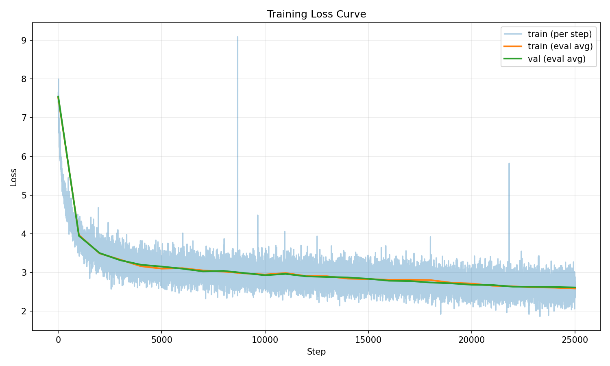

# nano-llada

`nano-llada` is a lightweight discrete diffusion language model project. The current release is **v0.1.0** with about **30M** parameters. It builds on open-source `minimind` and `tiny-diffusion`, and provides a full AR + Diffusion pipeline for pretraining, SFT, and evaluation.

For the Chinese version of this document, see `README_cn.md`.

## Project Status

- Current version: `v0.1.0`
- Parameter scale: `~30M`
- Current capability: initial engineering reproduction of the LLaDA 1.0 idea
- Progress: after SFT, `nano-llada` has gained basic question-answering ability; training and tuning are still ongoing for better results.
- Note: this implementation is not yet a strict 1:1 reproduction of every technical detail from the original LLaDA 1.0 report. We are continuously refining components.
- Training tracks:
  - AR (MiniMind-style causal LM)
  - Diffusion (LLaDA-style masked denoising)

## Overall Approach

We reuse `minimind` for base model construction, dataset format, and tokenizer. We first pretrain an autoregressive model, then build a parameter-matched LLaDA model inspired by LLaDA 2.0 training techniques, initialize it from AR pretrained weights, and continue with SFT and evaluation.

## Shared Architecture (AR + LLaDA)

```mermaid
flowchart TD
    A[Tokenizer / Input IDs] --> B[Token Embedding]
    B --> C[N x Transformer Block]

    subgraph C [Shared Transformer Backbone]
      C1[RMSNorm]
      C2[Multi-Head Attention + RoPE]
      C3[Residual Add]
      C4[RMSNorm]
      C5[SwiGLU MLP\n(gate_proj/up_proj/down_proj)]
      C6[Residual Add]
      C1 --> C2 --> C3 --> C4 --> C5 --> C6
    end

    C --> D[Final RMSNorm]
    D --> E[LM Head (Linear to Vocab Logits)]

    E --> F1[AR Branch (MiniMind)]
    E --> F2[LLaDA Branch (Diffusion)]

    F1 --> G1[Causal Attention\nNext-token CE Loss]
    F1 --> H1[Autoregressive Decoding]

    F2 --> G2[Non-causal / Masked Denoising Loss]
    F2 --> H2[Iterative Unmask Decoding\n(confidence/top-k/cap)]
```

## Environment Setup

```bash
pip install uv
uv sync
```

## Dataset Setup

```bash
pip install modelscope
mkdir -p dataset && modelscope download --dataset gongjy/minimind_dataset pretrain_hq.jsonl --local_dir ./dataset
mkdir -p dataset && modelscope download --dataset gongjy/minimind_dataset sft_mini_512.jsonl --local_dir ./dataset
```

## Training and Evaluation

### 1. AR Pretraining

```bash
uv run python -m scripts.train.train_pretrain \
  --data ./dataset/pretrain_hq.jsonl \
  --jsonl-field text \
  --tokenizer-dir . \
  --run-name minimind_pretrain \
  --hidden-size 512 \
  --num-hidden-layers 8 \
  --num-attention-heads 8 \
  --max-seq-len 256 \
  --epochs 1 \
  --batch-size 96
```

### 2. AR Evaluation

```bash
uv run python -m scripts.eval.eval_minimind \
  --checkpoint weights/minimind_pretrain_state_dict.pt \
  --tokenizer-dir . \
  --prompt "请介绍你自己。" \
  --max-new-tokens 200
```

### 3. nano-llada Pretraining

```bash
uv run python -m scripts.train.diffusion \
  --train \
  --use-tokenizer \
  --data ./dataset/pretrain_hq.jsonl \
  --inference-rope-scaling \
  --learning-rate 4e-4 \
  --warmup-steps 2000 \
  --min-lr-ratio 0.025 \
  --mask-schedule iid_t \
  --repeat-penalty-weight 0 \
  --init-from-minimind weights/minimind_pretrain_state_dict.pt \
  --run-name diffusion_from_ar_eq3 \
  --early-stop-patience 5 \
  --early-stop-min-delta 0.001 \
  --max-iters 40000 \
  --batch-size 96
```

### 4. nano-llada Evaluation

```bash
uv run python -m scripts.eval.eval_diffusion \
  --checkpoint weights/diffusion_no_v1.pt \
  --tokenizer-dir . \
  --seq-len 256 \
  --prompt "请介绍你自己。" \
  --max-new-tokens 200
```

## nano-llada Pretraining Loss (Chinese Dataset)

The following are diffusion pretraining loss curves on the Chinese dataset:

- `25k` steps:



- `40k` steps:


### 5. AR SFT

```bash
uv run python -m scripts.train.train_sft_minimind \
  --data dataset/sft_mini_512.jsonl \
  --tokenizer-dir . \
  --load-from weights/minimind_pretrain_state_dict.pt \
  --run-name minimind_sft \
  --max-seq-len 512 \
  --batch-size 96 \
  --epochs 2
```

### 6. nano-llada SFT

```bash
uv run python -m scripts.train.train_sft_diffusion \
  --data dataset/sft_mini_512.jsonl \
  --tokenizer-dir . \
  --load-from weights/diffusion_from_ar_eq3_3g_en.pt \
  --run-name diffusion_sft \
  --max-seq-len 512 \
  --batch-size 96 \
  --epochs 3
```

### 7. Single-Prompt SFT Evaluation

AR SFT:
```bash
uv run python -m scripts.eval.eval_sft_one_prompt \
  --prompt "你好，请介绍你自己。" \
  --tokenizer-dir . \
  --minimind-checkpoint weights/minimind_sft_state_dict.pt \
  --seq-len 512 \
  --max-new-tokens 128
```

nano-llada SFT:
```bash
uv run python -m scripts.eval.eval_sft_one_prompt \
  --prompt "你好，请介绍你自己。" \
  --tokenizer-dir . \
  --diffusion-checkpoint weights/diffusion_sft_state_dict.pt \
  --seq-len 512 \
  --max-new-tokens 128
```

AR + nano-llada comparison:
```bash
uv run python -m scripts.eval.eval_sft_one_prompt \
  --prompt "你好，请介绍你自己。" \
  --tokenizer-dir . \
  --minimind-checkpoint weights/minimind_sft_state_dict.pt \
  --diffusion-checkpoint weights/diffusion_sft_state_dict.pt \
  --seq-len 512 \
  --max-new-tokens 128
```

## Technical Report

See `technical_report.md`.

Positioning:
- engineering implementation of `nano-llada (~30M)`
- current version is `v0.1.0`
- continuous iterative refinement in this repository

## Roadmap

1. Improve `v0.1.x` (training stability, decoding strategy, evaluation pipeline).  
2. Reproduce `LLaDA 2.0`.  
3. Reproduce `LLaDA 2.1`.  
4. Train on English datasets and build a unified Chinese/English evaluation protocol.  
5. Target stronger controllable generation quality and overall performance.

## References

- minimind: https://github.com/jingyaogong/minimind
- tiny-diffusion: https://github.com/nathan-barry/tiny-diffusion
